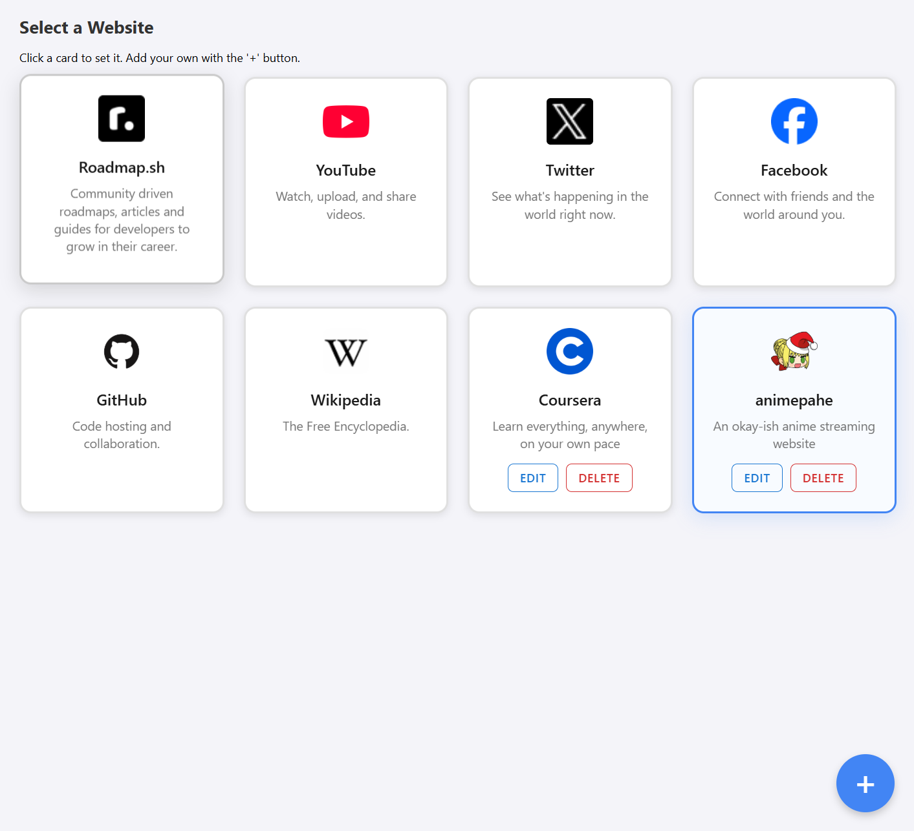

<!-- Quick Window Opener 🚀 -->

# Quick Window Opener

> Your _one-click_ launchpad for the web.

Stop digging through bookmarks or drowning in tabs.  
With a single tap, this extension opens the site you **actually** want in a pristine, distraction-free window.

---

## ✨ Why you’ll like it

- **Instant access** – click the icon, get the site.
- **Visual grid** – cards are prettier (and faster) than lists.
- **Yours to curate** – keep the pre-loaded favourites or swap in your own links, icons and descriptions.
- **Synced everywhere** – configure once, use on every signed-in Chrome.
- **Manifest V3** – modern, lightweight, permission-respectful.

---

## ⚙️ Install in 60 seconds

1. `git clone https://github.com/ahmed-bahlaoui/url-opener-extension.git`
2. Chrome → `chrome://extensions` → toggle **Developer mode**
3. Click **Load unpacked**, pick the cloned folder.
4. Pin the new icon to your toolbar 🍻

---

## 🕹️ Use it

1. **Right-click** the extension icon → **Options**
2. **Click the card** you want to launch.
3. Done. Every left-click on the icon now fires that site.

Need a site that’s not there?  
Hit the **blue “+”**, drop in the URL, icon and a short blurb—saved instantly, synced automatically.

---

## 🧰 Tech stack

- HTML5 + CSS3 (Grid & Flexbox)
- Vanilla ES6+ JavaScript
- Chrome Extension APIs (MV3)

---

## 🗺️ Roadmap

- [x] Delete and edit custom sites
- [x] Drag-to-reorder cards
- [ ] Global keyboard shortcut

---

## 📄 License

MIT – open, do-whatever-you-want goodness.
